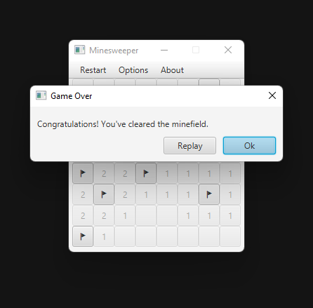
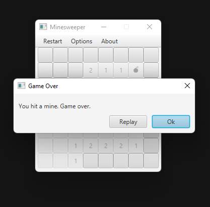

# minesweeper
----
> 
> Created with Java and JavaFX

This was a fun little project that I did in order to understand JavaFX a bit more as well as to have experience in something other than the projects they gave us at school. My goal for this project was to have a Minesweeper clone that could do the following: 
- reveal empty areas
- flag tiles
- difficulty options
- the ability to play as many games as you wanted
- determine if you won/lost without having to flag all the mines

I was successful in achieving what I had set out to do and am happy to call this project finished. I was able to develop my skills in both programming and reading documentation as well as gaining more practice with tools that we touched upon in class.

---
### Images
##### End Screens
> Winning
> 

> Losing
> 

##### Difficulties
> Beginner | 9x9 with 10 mines
> 

> Advanced | 16x16 with 40 mines
> 

> Expert | 30x16 with 99 mines
> 
